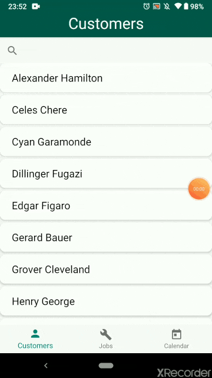

# BauerPW
This repository contains the UI Prototype of the Bauer Pressure Washing operations management system.

v1.0 - Customers, Jobs, and Calendar views created. Customers and Jobs fill with hardcoded information.

## TODO
* Add fragments for displaying customer details and job details
* Populate calendar with jobs
* Make search operational
* Add all additional UI elements belonging to [Mockups](https://toddbauer.atlassian.net/wiki/spaces/BPW/pages/99156106/Mockup)

